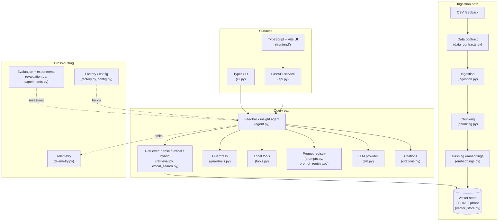
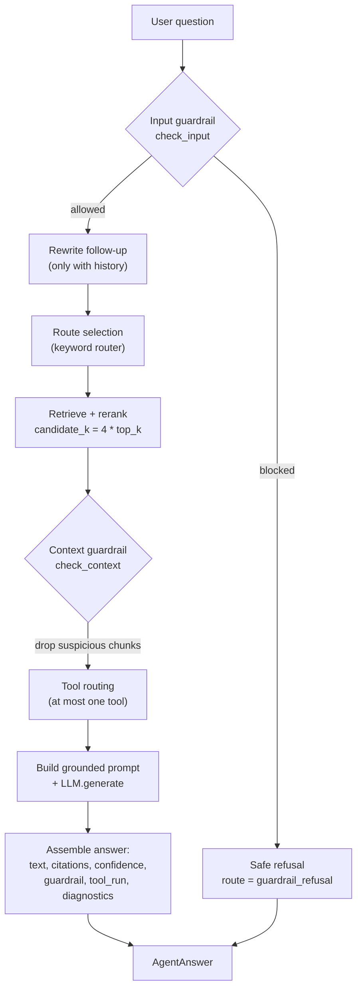
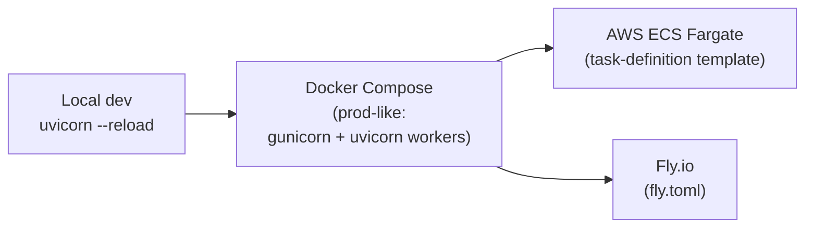

# Case study: Customer Feedback Intelligence Agent

A portfolio walkthrough of an evidence-grounded RAG system for turning raw
customer feedback into cited, actionable product insights. This document is
written for recruiters and hiring managers who want the shape of the work in a
few minutes, and for senior engineers who want the design decisions and
trade-offs in detail.

The entire system runs **locally and deterministically by default** — no API
keys, no managed services, no network access. Paid LLMs and a managed vector
database are optional, opt-in extensions behind stable interfaces.

- Source: [`src/ai_engineering_showcase/`](../src/ai_engineering_showcase/)
- Companion docs: [architecture.md](architecture.md) ·
  [evaluation.md](evaluation.md) · [prompts.md](prompts.md) ·
  [deployment.md](deployment.md)

---

## Problem

Product, support, and customer-success teams collect feedback faster than they
can read it: support tickets, NPS surveys, in-app messages, and reviews. The
useful signal — *which themes recur, in which segments, and what to do about
them* — is buried in unstructured text. The usual responses each fail in their
own way:

- **Manual triage** does not scale and is not repeatable.
- **Keyword dashboards** miss paraphrase and intent.
- **A raw LLM over the corpus** is fluent but unverifiable: it cannot show its
  evidence, it confidently answers questions the data cannot support, and it
  cannot be regression-tested.

The hard requirement is not "summarize feedback." It is to produce answers a
human can **trust and verify**: every claim tied to a specific piece of
retrieved feedback, an explicit refusal when the corpus has no answer, and
behaviour that is measurable and stable enough to gate in CI.

## Why this project exists

This repository is a deliberately compact but production-shaped reference for
the AI engineering loop: **ingest → retrieve → ground → generate → evaluate →
observe → serve → deploy**. It is small enough to read end-to-end, but it draws
the same boundaries a real system would, so each layer can be swapped without a
rewrite.

The design priority is **determinism**. The default LLM
([`DeterministicLLM` in llm.py](../src/ai_engineering_showcase/llm.py)) and the
hashing embedding model
([embeddings.py](../src/ai_engineering_showcase/embeddings.py)) produce
byte-identical output for the same inputs. That makes the evaluation report a
trustworthy CI regression gate, lets prompts be pinned with golden snapshot
tests, and means a reviewer can clone the repo and reproduce every number
without provisioning anything.

## System architecture

The system is a set of small, typed modules behind explicit interfaces. The
ingestion path builds an index; the query path retrieves evidence, runs
guardrails and optional tools, generates a grounded answer, and returns
citations plus diagnostics. A FastAPI service and a TypeScript/Vite frontend sit
on top.

Component responsibilities are documented in
[architecture.md](architecture.md); the wiring is centralized in
[factory.py](../src/ai_engineering_showcase/factory.py), which reads
configuration from [config.py](../src/ai_engineering_showcase/config.py) and
fails fast with actionable errors on misconfiguration.

## Key AI engineering decisions

1. **Deterministic local-first default.** The local provider and hashing
   embeddings make the whole pipeline reproducible. This is what unlocks
   snapshot-tested prompts and an evaluation report usable as a CI gate.
2. **Provider behind a protocol.** Answer generation is gated by the
   `LLMProvider` protocol in [llm.py](../src/ai_engineering_showcase/llm.py),
   with four implementations (`local`, `openai`-compatible, `anthropic`,
   `ollama`) and per-provider capability metadata (`supports_streaming`,
   `supports_tool_calling`, `supports_json_mode`, `max_context_tokens`).
   Optional SDKs are extras so the default install stays lean.
3. **Pluggable vector store.** A common `VectorStore` interface
   ([vector_store.py](../src/ai_engineering_showcase/vector_store.py)) backs
   both the default in-memory JSON store and an optional Qdrant backend, with no
   change to retrieval code.
4. **Prompts as versioned assets.** Prompts live in a versioned registry
   ([prompt_registry.py](../src/ai_engineering_showcase/prompt_registry.py),
   [prompts.py](../src/ai_engineering_showcase/prompts.py)) with declared
   variables, changelog notes, and byte-level golden snapshot tests — see
   [prompts.md](prompts.md).
5. **Determinism over cleverness in routing and tools.** Query routing, tool
   selection, and the conversation query-rewriter are all rule-based, so their
   behaviour is reproducible and auditable rather than dependent on a model
   call.
6. **Safety as a deterministic, auditable layer.** Guardrails are documented
   regular expressions, not a model
   ([guardrails.py](../src/ai_engineering_showcase/guardrails.py)).

## RAG pipeline

Ingestion validates each row against a data contract
([data_contracts.py](../src/ai_engineering_showcase/data_contracts.py)) — the
contract requires `feedback_id`, `customer_segment`, `channel`, `rating`,
`text`, and `created_at` and reports missing columns, empty text, duplicate IDs,
and invalid timestamps. Valid rows are chunked into overlapping word windows
([chunking.py](../src/ai_engineering_showcase/chunking.py)), embedded with
deterministic feature hashing
([embeddings.py](../src/ai_engineering_showcase/embeddings.py)), and persisted.

Retrieval is exposed behind a single `Retriever` protocol
([retrieval.py](../src/ai_engineering_showcase/retrieval.py)) with three
interchangeable strategies:

- **dense** (default): cosine similarity over hashing embeddings — robust to
  paraphrase.
- **lexical**: a local BM25 index
  ([lexical_search.py](../src/ai_engineering_showcase/lexical_search.py)) — good
  for exact domain terms (product names, integrations, error codes).
- **hybrid**: queries both, min-max normalizes each score list, de-duplicates
  by chunk ID, and combines as `dense_weight * dense + lexical_weight * lexical`
  (weights normalized to sum to 1).

After first-stage retrieval the agent applies a lightweight, domain-aware
rerank that blends the retriever score with query-term overlap, route-keyword
hits, segment match, and a low-rating signal for risk questions (see
`_combined_score` in [agent.py](../src/ai_engineering_showcase/agent.py)). The
grounded prompt is then built with numbered `citation: [n]` context blocks, so
the answer can reference evidence by index.

## Agent design

The agent ([agent.py](../src/ai_engineering_showcase/agent.py)) orchestrates the
full per-question flow. It is single-turn by default and gains persistent
multi-turn memory when conversation history is supplied.

Notable elements:

- **Two guardrail gates.** `check_input` refuses unsafe questions *before* any
  retrieval; `check_context` scans retrieved chunks and drops ones carrying
  instruction-override content (indirect prompt injection planted in feedback)
  so they are never cited or summarized.
- **Deterministic tool framework.** [tools.py](../src/ai_engineering_showcase/tools.py)
  ships three local tools — `sentiment_summary`, `issue_cluster`, and
  `ticket_draft` — each with a typed Pydantic input/output schema. A keyword
  router selects at most one tool; unknown explicit tool requests are refused
  gracefully and the run continues as plain RAG. Tool failures degrade to an
  `error` record rather than failing the run.
- **Citations the agent cannot fabricate.** Citations are built only from
  actually retrieved chunks ([citations.py](../src/ai_engineering_showcase/citations.py)),
  each carrying a stable id, document/chunk id, source channel, evidence quote,
  and retrieval score.
- **Conversation memory.** Multi-turn chat persists turns to disk
  ([memory.py](../src/ai_engineering_showcase/memory.py)). Follow-ups are
  rewritten into standalone questions by a deterministic local rewriter (an
  optional `LLMQueryRewriter` can delegate to a provider); only the rewritten
  question reaches retrieval, and the rewrite is reported transparently in
  diagnostics.

## Evaluation strategy

RAG fails in two distinct places: retrieval can miss the evidence, or generation
can ignore the evidence it was given. The harness
([evaluation.py](../src/ai_engineering_showcase/evaluation.py)) therefore scores
each stage separately over a JSONL dataset and emits a typed `EvaluationReport`:

- **Retrieval:** `precision_at_k`, `recall_at_k`, `mean_reciprocal_rank`,
  `context_hit_rate`.
- **Answer quality:** `keyword_coverage`, `groundedness`, `citation_alignment`,
  and `refusal_correctness` (does the system abstain on unanswerable
  questions?).

Because the local provider is deterministic, two runs over the same index and
dataset produce identical reports, so the report works as a **CI regression
gate** and for A/B comparison of configurations. The
[experiment runner](../src/ai_engineering_showcase/experiments.py) builds a fresh
index from a YAML-described configuration and writes reproducible
`results.json` / `metrics.json` plus environment-only `run_metadata.json`,
making it easy to diff, for example, dense vs. hybrid retrieval. Full metric
rationale is in [evaluation.md](evaluation.md).

## Observability strategy

Telemetry ([telemetry.py](../src/ai_engineering_showcase/telemetry.py)) emits
OpenTelemetry-style structured events around ingestion, retrieval, LLM calls,
tool runs, agent runs, and evaluation. Each event carries a name, an ISO-8601
UTC timestamp, a `correlation_id` shared across one logical operation, a
`duration_ms` for finished spans, and a metadata dictionary (latency, retrieval
counts and scores, provider, route, confidence, guardrail decisions).

Telemetry is **disabled by default and side-effect-free**; sinks are injected
explicitly. Enabling it appends one JSON object per event to a JSONL trace file.
Blocked runs are recorded with `guardrail_allowed: false`, so refusals are
observable, not silent. Separately, the
[benchmark harness](../src/ai_engineering_showcase/benchmarking.py) measures
per-phase latency (index build, query embedding, retrieval, full agent response)
with robust statistics (mean, median, p95, min, max).

## Deployment path

The API ([api.py](../src/ai_engineering_showcase/api.py)) exposes `POST /query`,
streaming `POST /query/stream` (SSE, no extra dependencies), `POST /chat` plus
conversation retrieval, synchronous `POST /index`, asynchronous ingestion jobs
(`POST /ingestion/jobs` + polling), and `GET /health` (liveness) and
`GET /ready` (readiness) probes. Asynchronous ingestion uses FastAPI
`BackgroundTasks` ([jobs.py](../src/ai_engineering_showcase/jobs.py)) — no
Celery/Redis — and never leaks stack traces or paths to clients on failure.

The [`deploy/`](../deploy) folder ships a production-like Compose file, an ECS
Fargate task-definition template, and a Fly.io config. Manifests use
placeholders only and commit no secrets; secrets are sourced from env files,
AWS Secrets Manager, or `fly secrets`. CI
([.github/workflows/ci.yml](../.github/workflows/ci.yml)) runs ruff lint, ruff
format check, mypy strict, pytest with a coverage floor, and a package build
across Python 3.10–3.12. Scope and honest limitations (no IaC, autoscaling, TLS,
auth, or rate limiting) are documented in [deployment.md](deployment.md).

## Trade-offs

These are deliberate choices, made to keep the project reproducible and
readable; each names what was given up.

- **Hashing embeddings, not neural ones.** Deterministic and dependency-free,
  but no semantic generalization beyond surface tokens. Swappable behind
  `EmbeddingModel` for a real embedding service.
- **Deterministic local LLM by default.** Reproducible and free, but it is a
  structured evidence-driven generator, not a fluent model. Real fluency comes
  from the optional `openai`/`anthropic`/`ollama` providers.
- **In-memory JSON vector store by default.** Zero-setup and easy to inspect,
  but single-node and not built for large corpora — switch to the Qdrant backend
  for scale or multi-instance deployments.
- **Rule-based routing, tool selection, and guardrails.** Auditable and
  reproducible, but less flexible than learned/function-calling approaches; they
  rely on maintained keyword and regex lists.
- **Lexical groundedness proxy in evaluation.** Cheap and deterministic, but a
  proxy — it does not catch semantically-grounded paraphrase failures the way an
  NLI model or LLM-as-judge would.
- **Synchronous-by-default ingestion with a lightweight async path.** Simple and
  dependency-free, but the in-process job store is not a substitute for a durable
  queue in a multi-worker deployment.

## Future work

Tracked in [ROADMAP.md](../ROADMAP.md). High-value next steps:

- **Retrieval:** metadata filters (segment, rating, channel, date), query
  expansion for product terminology, and cross-encoder / LLM-judge reranking.
- **Generation:** structured JSON output validation with automatic repair, and
  retry/timeout/circuit-breaker policies for remote providers.
- **Evaluation & observability:** experiment tracking (MLflow / W&B),
  OpenTelemetry trace export, and dashboards for latency, retrieval-score
  distribution, and citation coverage.
- **Data engineering:** streaming ingestion (Kafka/Kinesis), incremental index
  updates, and PII redaction before indexing.
- **Product & platform:** human feedback capture on answers, saved insight
  reports, multi-tenant isolation, and auth/rate limiting on the API.
