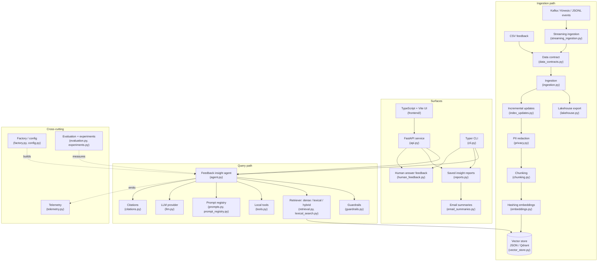
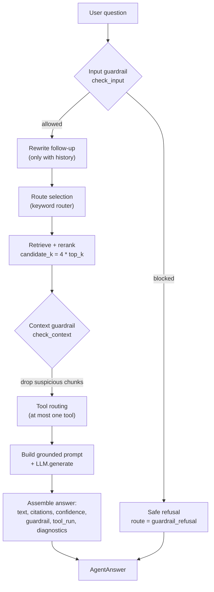
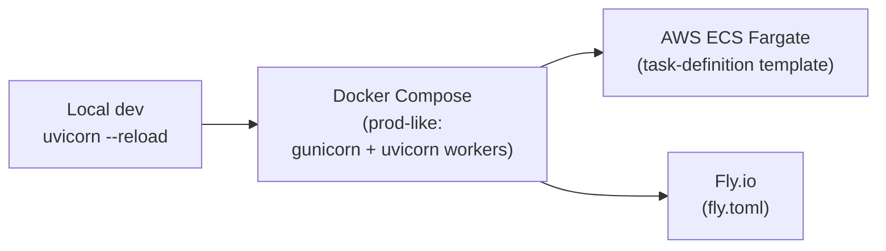

# Case study: Customer Feedback Intelligence Agent

A portfolio walkthrough of an evidence-grounded RAG system for turning raw
customer feedback into cited, actionable product insights. This document is
written for recruiters and hiring managers who want the shape of the work in a
few minutes, and for senior engineers who want the design decisions and
trade-offs in detail.

The entire system runs **locally and deterministically by default** — no API
keys, no managed services, no network access. Paid LLMs and a managed vector
database are optional, opt-in extensions behind stable interfaces.

- Source: [`src/feedback_intelligence_agent/`](../src/feedback_intelligence_agent/)
- Companion docs: [architecture.md](architecture.md) ·
  [evaluation.md](evaluation.md) · [prompts.md](prompts.md) ·
  [deployment.md](deployment.md)

---

## Problem

Product, support, and customer-success teams collect feedback faster than they
can read it: support tickets, NPS surveys, in-app messages, and reviews. The
useful signal — *which themes recur, in which segments, and what to do about
them* — is buried in unstructured text. The usual responses each fail in their
own way:

- **Manual triage** does not scale and is not repeatable.
- **Keyword dashboards** miss paraphrase and intent.
- **A raw LLM over the corpus** is fluent but unverifiable: it cannot show its
  evidence, it confidently answers questions the data cannot support, and it
  cannot be regression-tested.

The hard requirement is not "summarize feedback." It is to produce answers a
human can **trust and verify**: every claim tied to a specific piece of
retrieved feedback, an explicit refusal when the corpus has no answer, and
behaviour that is measurable and stable enough to gate in CI.

## Why this project exists

This repository is a deliberately compact but production-shaped reference for
the AI engineering loop: **ingest → retrieve → ground → generate → evaluate →
observe → serve → deploy**. It is small enough to read end-to-end, but it draws
the same boundaries a real system would, so each layer can be swapped without a
rewrite.

The design priority is **determinism**. The default LLM
([`DeterministicLLM` in llm.py](../src/feedback_intelligence_agent/llm.py)) and the
hashing embedding model
([embeddings.py](../src/feedback_intelligence_agent/embeddings.py)) produce
byte-identical output for the same inputs. That makes the evaluation report a
trustworthy CI regression gate, lets prompts be pinned with golden snapshot
tests, and means a reviewer can clone the repo and reproduce every number
without provisioning anything.

## System architecture

The system is a set of small, typed modules behind explicit interfaces. Batch
and stream ingestion paths validate feedback before indexing; the query path
retrieves evidence, runs guardrails and optional tools, generates a grounded
answer, and returns citations plus diagnostics. A FastAPI service and a
TypeScript/Vite frontend sit on top.

```mermaid
flowchart TB
  subgraph Ingest["Ingestion path"]
    CSV["CSV feedback"] --> DC["Data contract<br/>(data_contracts.py)"]
    STREAM["Kafka / Kinesis / JSONL events"] --> SI["Streaming ingestion<br/>(streaming_ingestion.py)"]
    SI --> DC
    DC --> ING["Ingestion<br/>(ingestion.py)"]
    ING --> LH["Lakehouse export<br/>(lakehouse.py)"]
    ING --> UPD["Incremental updates<br/>(index_updates.py)"]
    UPD --> PRV["PII redaction<br/>(privacy.py)"]
    PRV --> CH["Chunking<br/>(chunking.py)"]
    CH --> EMB["Hashing embeddings<br/>(embeddings.py)"]
    EMB --> VS[("Vector store<br/>JSON / Qdrant<br/>(vector_store.py)")]
  end

  subgraph Query["Query path"]
    AG["Feedback insight agent<br/>(agent.py)"]
    RET["Retriever: dense / lexical / hybrid<br/>(retrieval.py, lexical_search.py)"]
    GR["Guardrails<br/>(guardrails.py)"]
    TL["Local tools<br/>(tools.py)"]
    PR["Prompt registry<br/>(prompts.py, prompt_registry.py)"]
    LLM["LLM provider<br/>(llm.py)"]
    CIT["Citations<br/>(citations.py)"]
    AG --> GR
    AG --> RET
    RET --> VS
    AG --> TL
    AG --> PR
    AG --> LLM
    AG --> CIT
  end

  subgraph Surfaces["Surfaces"]
    API["FastAPI service<br/>(api.py)"]
    CLI["Typer CLI<br/>(cli.py)"]
    FE["TypeScript + Vite UI<br/>(frontend/)"]
    REP["Saved insight reports<br/>(reports.py)"]
    EMAIL["Email summaries<br/>(email_summaries.py)"]
    HF["Human answer feedback<br/>(human_feedback.py)"]
  end

  subgraph Cross["Cross-cutting"]
    FAC["Factory / config<br/>(factory.py, config.py)"]
    TEL["Telemetry<br/>(telemetry.py)"]
    EVAL["Evaluation + experiments<br/>(evaluation.py, experiments.py)"]
  end

  API --> AG
  CLI --> AG
  FE --> API
  API --> REP
  CLI --> REP
  API --> HF
  CLI --> HF
  REP --> EMAIL
  FAC -.builds.-> AG
  AG -.emits.-> TEL
  EVAL -.measures.-> AG
```

Component responsibilities are documented in
[architecture.md](architecture.md); the wiring is centralized in
[factory.py](../src/feedback_intelligence_agent/factory.py), which reads
configuration from [config.py](../src/feedback_intelligence_agent/config.py) and
fails fast with actionable errors on misconfiguration.

## Key AI engineering decisions

1. **Deterministic local-first default.** The local provider and hashing
   embeddings make the whole pipeline reproducible. This is what unlocks
   snapshot-tested prompts and an evaluation report usable as a CI gate.
2. **Provider behind a protocol.** Answer generation is gated by the
   `LLMProvider` protocol in [llm.py](../src/feedback_intelligence_agent/llm.py),
   with six implementations (`local`, `openai`, `openai_responses`,
   `anthropic`, `bedrock`, `ollama`) and per-provider capability metadata (`supports_streaming`,
   `supports_tool_calling`, `supports_json_mode`, `max_context_tokens`).
   Optional SDKs are extras so the default install stays lean. Remote providers
   are wrapped with retry, timeout, and circuit-breaker policies in
   [resilience.py](../src/feedback_intelligence_agent/resilience.py).
3. **Pluggable vector store.** A common `VectorStore` interface
   ([vector_store.py](../src/feedback_intelligence_agent/vector_store.py)) backs
   both the default in-memory JSON store and an optional Qdrant backend, with no
   change to retrieval code.
4. **Prompts as versioned assets.** Prompts live in a versioned registry
   ([prompt_registry.py](../src/feedback_intelligence_agent/prompt_registry.py),
   [prompts.py](../src/feedback_intelligence_agent/prompts.py)) with declared
   variables, changelog notes, and byte-level golden snapshot tests — see
   [prompts.md](prompts.md).
5. **Determinism over cleverness in routing and tools.** Query routing, tool
   selection, and the conversation query-rewriter are all rule-based, so their
   behaviour is reproducible and auditable rather than dependent on a model
   call.
6. **Safety as a deterministic, auditable layer.** Guardrails are documented
   regular expressions, not a model
   ([guardrails.py](../src/feedback_intelligence_agent/guardrails.py)).

## RAG pipeline

Ingestion validates each row against a data contract
([data_contracts.py](../src/feedback_intelligence_agent/data_contracts.py)) — the
contract requires `feedback_id`, `customer_segment`, `channel`, `rating`,
`text`, and `created_at`, accepts optional `tenant_id`, and reports missing
columns, empty text, duplicate IDs scoped by tenant, and invalid timestamps.
Streaming ingestion
([streaming_ingestion.py](../src/feedback_intelligence_agent/streaming_ingestion.py))
validates bounded JSONL, Kafka, or Kinesis event batches through the same
`FeedbackRecord` schema, checkpoints accepted offsets, and can write rejected
messages to a dead-letter JSONL file. Incremental updates
([index_updates.py](../src/feedback_intelligence_agent/index_updates.py)) merge
validated records into the persisted JSON index by replacing existing chunks for
matching tenant-scoped source IDs before appending fresh chunks. Before storage, the
privacy layer ([privacy.py](../src/feedback_intelligence_agent/privacy.py))
redacts emails, phone numbers, and obvious access tokens from feedback text and
stream dead-letter payloads. Valid rows are chunked into overlapping word windows
([chunking.py](../src/feedback_intelligence_agent/chunking.py)), embedded with
deterministic feature hashing
([embeddings.py](../src/feedback_intelligence_agent/embeddings.py)), and persisted.
For analytics handoff, [lakehouse.py](../src/feedback_intelligence_agent/lakehouse.py)
exports the same validated, redacted records into partitioned JSONL files with
Delta-style or Iceberg-style metadata, including optional `tenant_id`
partitioning.

Retrieval is exposed behind a single `Retriever` protocol
([retrieval.py](../src/feedback_intelligence_agent/retrieval.py)) with three
interchangeable strategies:

- **dense** (default): cosine similarity over hashing embeddings — robust to
  paraphrase.
- **lexical**: a local BM25 index
  ([lexical_search.py](../src/feedback_intelligence_agent/lexical_search.py)) — good
  for exact domain terms (product names, integrations, error codes).
- **hybrid**: queries both, min-max normalizes each score list, de-duplicates
  by chunk ID, and combines as `dense_weight * dense + lexical_weight * lexical`
  (weights normalized to sum to 1).

After first-stage retrieval the agent applies a lightweight, domain-aware
rerank that blends the retriever score with query-term overlap, route-keyword
hits, segment match, and a low-rating signal for risk questions (see
`_combined_score` in [agent.py](../src/feedback_intelligence_agent/agent.py)). The
grounded prompt is then built with numbered `citation: [n]` context blocks, so
the answer can reference evidence by index.

## Agent design

The agent ([agent.py](../src/feedback_intelligence_agent/agent.py)) orchestrates the
full per-question flow. It is single-turn by default and gains persistent
multi-turn memory when conversation history is supplied.

```mermaid
flowchart TD
  Q["User question"] --> IG{"Input guardrail<br/>check_input"}
  IG -- blocked --> REF["Safe refusal<br/>route = guardrail_refusal"]
  IG -- allowed --> RW["Rewrite follow-up<br/>(only with history)"]
  RW --> RO["Route selection<br/>(keyword router)"]
  RO --> RT["Retrieve + rerank<br/>candidate_k = 4 * top_k"]
  RT --> CG{"Context guardrail<br/>check_context"}
  CG -- drop suspicious chunks --> TR["Tool routing<br/>(at most one tool)"]
  TR --> GEN["Build grounded prompt<br/>+ LLM.generate"]
  GEN --> ASM["Assemble answer:<br/>text, citations, confidence,<br/>guardrail, tool_run, diagnostics"]
  ASM --> OUT["AgentAnswer"]
  REF --> OUT
```

Notable elements:

- **Two guardrail gates.** `check_input` refuses unsafe questions *before* any
  retrieval; `check_context` scans retrieved chunks and drops ones carrying
  instruction-override content (indirect prompt injection planted in feedback)
  so they are never cited or summarized.
- **Deterministic tool framework.** [tools.py](../src/feedback_intelligence_agent/tools.py)
  ships three local tools — `sentiment_summary`, `issue_cluster`, and
  `ticket_draft` — each with a typed Pydantic input/output schema. A keyword
  router selects at most one tool; unknown explicit tool requests are refused
  gracefully and the run continues as plain RAG. Tool failures degrade to an
  `error` record rather than failing the run.
- **Citations the agent cannot fabricate.** Citations are built only from
  actually retrieved chunks ([citations.py](../src/feedback_intelligence_agent/citations.py)),
  each carrying a stable id, document/chunk id, source channel, evidence quote,
  and retrieval score.
- **Conversation memory.** Multi-turn chat persists turns to disk
  ([memory.py](../src/feedback_intelligence_agent/memory.py)). Follow-ups are
  rewritten into standalone questions by a deterministic local rewriter (an
  optional `LLMQueryRewriter` can delegate to a provider); only the rewritten
  question reaches retrieval, and the rewrite is reported transparently in
  diagnostics.
- **Saved insight reports.** Generated answers can be persisted through
  [reports.py](../src/feedback_intelligence_agent/reports.py) with a title,
  tags, notes, citations, diagnostics, and the full `AgentAnswer`. The API and
  CLI share the same JSON-backed store, saved reports can be exported as
  Markdown, and the frontend can save answers from the analyst workflow.
- **Email summaries.** Saved reports can be rendered into a plain-text digest by
  [email_summaries.py](../src/feedback_intelligence_agent/email_summaries.py).
  Dry-run rendering is local and deterministic; SMTP delivery is optional and
  configuration-driven.
- **Human answer feedback.** Reviewers can mark generated answers as useful or
  not useful through [human_feedback.py](../src/feedback_intelligence_agent/human_feedback.py).
  The API, CLI, and frontend share the same JSON-backed store, preserving the
  full `AgentAnswer` alongside optional comments, tags, and linked report IDs.
  The same records power useful-rate analytics by route and tenant plus an
  active-learning queue for not-useful or low-confidence answers. Queue items
  can be assigned and moved through workflow states in
  [active_learning.py](../src/feedback_intelligence_agent/active_learning.py).

## Evaluation strategy

RAG fails in two distinct places: retrieval can miss the evidence, or generation
can ignore the evidence it was given. The harness
([evaluation.py](../src/feedback_intelligence_agent/evaluation.py)) therefore scores
each stage separately over a JSONL dataset and emits a typed `EvaluationReport`:

- **Retrieval:** `precision_at_k`, `recall_at_k`, `mean_reciprocal_rank`,
  `context_hit_rate`.
- **Answer quality:** `keyword_coverage`, `groundedness`, `citation_alignment`,
  `evidence_overlap`, `hallucination_rate`, `judge_supported_rate`, and
  `refusal_correctness` (does the system abstain on unanswerable questions?).

Because the local provider is deterministic, two runs over the same index and
dataset produce identical reports, so the report works as a **CI regression
gate** and for A/B comparison of configurations. The
[experiment runner](../src/feedback_intelligence_agent/experiments.py) builds a fresh
index from a YAML-described configuration and writes reproducible
`results.json` / `metrics.json` plus environment-only `run_metadata.json`,
making it easy to diff, for example, dense vs. hybrid retrieval. Optional MLflow
tracking logs the same parameters, aggregate metrics, and JSON artifacts when
`tracking_provider: mlflow` is enabled. Full metric rationale is in
[evaluation.md](evaluation.md).

## Observability strategy

Telemetry ([telemetry.py](../src/feedback_intelligence_agent/telemetry.py)) emits
structured events around ingestion, embedding, retrieval, LLM calls, response
parsing, hallucination checks, tool runs, agent runs, and evaluation. Each event
carries a name, an ISO-8601 UTC timestamp, a `correlation_id` shared across one
logical operation, a `duration_ms` for finished spans, and a metadata dictionary
(latency, retrieval counts and scores, provider, route, confidence, guardrail
decisions, evidence-overlap score).

Telemetry is **disabled by default and side-effect-free**; sinks are injected
explicitly. The default enabled backend appends one JSON object per event to a
JSONL trace file for local inspection; the optional `otel` extra converts the
same started/finished pairs into OpenTelemetry spans through the process-global
tracer provider. Blocked runs are recorded with `guardrail_allowed: false`, so
refusals are observable, not silent. Separately, the
[benchmark harness](../src/feedback_intelligence_agent/benchmarking.py) measures
per-phase latency (index build, query embedding, retrieval, full agent response)
with robust statistics (mean, median, p95, min, max).

## Deployment path

The API ([api.py](../src/feedback_intelligence_agent/api.py)) exposes `POST /query`,
streaming `POST /query/stream` (SSE, no extra dependencies), `POST /chat` plus
conversation retrieval, saved report endpoints (`POST /reports`, `GET /reports`,
`GET /reports/{report_id}`, `GET /reports/{report_id}/markdown`,
`POST /reports/email-summary`), answer feedback
endpoints (`POST /answer-feedback`, `GET /answer-feedback`,
`GET /answer-feedback/analytics`, `GET /answer-feedback/active-learning`,
`GET /answer-feedback/active-learning/states`,
`PATCH /answer-feedback/active-learning/{feedback_id}`,
`GET /answer-feedback/{feedback_id}`),
synchronous `POST /index`,
asynchronous ingestion jobs (`POST /ingestion/jobs` + polling),
and `GET /health` (liveness) and `GET /ready` (readiness) probes. Asynchronous ingestion uses FastAPI
`BackgroundTasks` ([jobs.py](../src/feedback_intelligence_agent/jobs.py)) — no
Celery/Redis — and never leaks stack traces or paths to clients on failure.

```mermaid
flowchart LR
  Dev["Local dev<br/>uvicorn --reload"] --> Compose["Docker Compose<br/>(prod-like:<br/>gunicorn + uvicorn workers)"]
  Compose --> ECS["AWS ECS Fargate<br/>(task-definition template)"]
  Compose --> Fly["Fly.io<br/>(fly.toml)"]
```

The [`deploy/`](../deploy) folder ships a production-like Compose file, an ECS
Fargate task-definition template, and a Fly.io config. Manifests use
placeholders only and commit no secrets; secrets are sourced from env files,
AWS Secrets Manager, or `fly secrets`. CI
([.github/workflows/ci.yml](../.github/workflows/ci.yml)) runs ruff lint, ruff
format check, mypy strict, pytest with a coverage floor, and a package build
across Python 3.10–3.12. Scope and honest limitations (no IaC, autoscaling, TLS,
auth, or rate limiting) are documented in [deployment.md](deployment.md).

## Trade-offs

These are deliberate choices, made to keep the project reproducible and
readable; each names what was given up.

- **Hashing embeddings, not neural ones.** Deterministic and dependency-free,
  but no semantic generalization beyond surface tokens. Swappable behind
  `EmbeddingModel` for a real embedding service.
- **Deterministic local LLM by default.** Reproducible and free, but it is a
  structured evidence-driven generator, not a fluent model. Real fluency comes
  from the optional `openai`/`anthropic`/`bedrock`/`ollama` providers.
- **In-memory JSON vector store by default.** Zero-setup and easy to inspect,
  but single-node and not built for large corpora — switch to the Qdrant backend
  for scale or multi-instance deployments.
- **Rule-based routing, tool selection, and guardrails.** Auditable and
  reproducible, but less flexible than learned/function-calling approaches; they
  rely on maintained keyword and regex lists.
- **Deterministic-first hallucination checks.** Evidence overlap is cheap and
  reproducible, while the optional LLM-as-judge pass improves semantic review at
  the cost of latency and provider spend.
- **Deterministic local stream path.** JSONL stream ingestion and incremental
  JSON index updates exercise the same validation and merge behavior as
  Kafka/Kinesis adapters, but production deployments still need durable
  checkpoints and operational monitoring.
- **Local lakehouse metadata, not a table runtime.** The exporter writes
  deterministic partitioned files and Delta/Iceberg-style metadata without
  Spark, PyArrow, or object storage. Production would usually swap the data
  writer to Parquet through the chosen lakehouse runtime.

## Future work

Tracked in [ROADMAP.md](../ROADMAP.md). High-value next steps:

- **Retrieval:** optional external cross-encoder / LLM-judge rerankers and
  larger query suites for retrieval drift monitoring.
- **Generation:** provider-specific structured output modes and richer repair
  telemetry for malformed model responses.
- **Evaluation & observability:** alerting and SLOs for latency, retrieval-score
  distribution, citation coverage, and hallucination rate.
- **Data engineering:** broader privacy policy coverage, durable stream
  checkpoints, and production Parquet/table-runtime exports.
- **Product & platform:** human feedback capture on answers, Slack delivery,
  multi-tenant isolation, and auth/rate limiting on the API.
